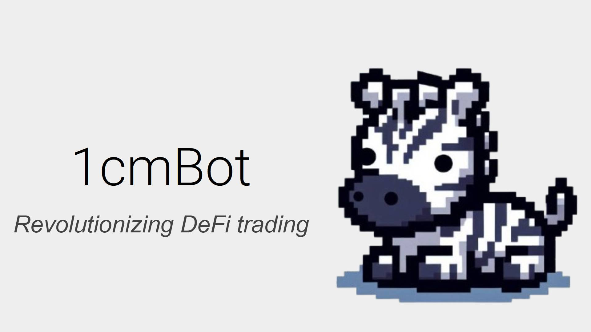

# 1cmBot - Revolutionizing DeFi trading

1cmBot is a Telegram bot that offers users an intuitive trading experience by leveraging the 1inch API for seamless swapping on their preferred network, such as Ethereum, Polygon and Base.

The blockchain interaction in our application is completely powered by the 1inch API - getting swap quotes, getting token balance, getting chart data, getting token info, performing swaps (hence the name 1cmBot!)

Users can manage their trades efficiently by first customizing the bot with their preferred settings as follows: 
    - Select chain to trade on
    - Select any pair of tokens to perform swaps
    - Specify slippage tolerance level

The general setup process for a new user is as follows:
1. Find the Telegram bot via username @onecm_bot or via URL
2. Press "Start". Server generates a unique wallet address for the user.
3. User taps on "Set Chain" and inputs the chain ID (e.g. 137 for Polygon)
4. User taps on "Token0" and inputs the token address (e.g. USDC's address)
5. User taps on "Token1" and inputs the token address (e.g. XSGD's address)

Before performing swaps, users will have to deposit Token0/Token1 selected during setup, and also deposit the token used for gas in their selected chain (e.g. POL for Polygon).

Once the above steps are done, users are ready to swap their way to huge profits! Buying/selling will then be a straightforward process, with users being able to perform transactions with two taps by first choosing "Buy" or "Sell", and then choosing from a predefined set of amounts to swap (i.e. 25%, 50%, 75%, 100%).

For the users' reference, the default prompt (main menu) will contain a graph of the selected token pair, which can be refreshed easily with one tap of the "Refresh" button. This allows users to be constantly updated with the token pairing's latest trend and make smart trading decisions all within the Telegram bot interface, enabling users to trade ahead of others and always get the best rates with the power of 1inch's smart routing.

Ultimately, this bot simplifies decentralized trading by offering essential controls in Telegram's user-friendly and familiar interface, making it accessible for both beginner and advanced traders.
